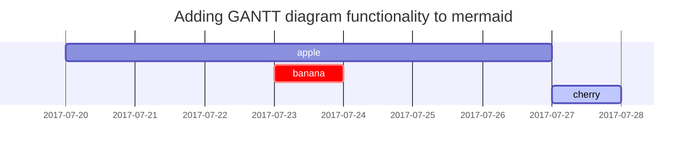

This post is to show Markdown syntax rendering on [**hrthtr5**](https://), you can also use it as an example of writing. Now, let's start looking at text and typography.


## Titles
---
# H1 - heading

<h2 data-toc-skip>H2 - heading</h2>

<h3 data-toc-skip>H3 - heading</h3>

<h4>H4 - heading</h4>
---
<br>

## Paragraph

I wandered lonely as a cloud

That floats on high o'er vales and hills,

When all at once I saw a crowd,

A host, of golden daffodils;

Beside the lake, beneath the trees,

Fluttering and dancing in the breeze.

## Lists

### Ordered list

1. Firstly
2. Secondly
3. Thirdly

### Unordered list

- Chapter
  - Section
    - Paragraph

### Task list

- [ ] TODO
- [x] Completed
- [ ] Defeat COVID-19
  - [x] Vaccine production
  - [ ] Economic recovery
  - [ ] People smile again

### Description list

Sun
: the star around which the earth orbits

Moon
: the natural satellite of the earth, visible by reflected light from the sun

## Block Quote

> This line shows the _block quote_.

## Prompts

> An example showing the `tip` type prompt.
{: .prompt-tip }

> An example showing the `info` type prompt.
{: .prompt-info }

> An example showing the `warning` type prompt.
{: .prompt-warning }

> An example showing the `danger` type prompt.
{: .prompt-danger }

## Tables

| Company                      | Contact          | Country |
|:-----------------------------|:-----------------|--------:|
| Alfreds Futterkiste          | Maria Anders     | Germany |
| Island Trading               | Helen Bennett    | UK      |
| Magazzini Alimentari Riuniti | Giovanni Rovelli | Italy   |

## Links

<http://127.0.0.1:4000>

## Footnote

Click the hook will locate the footnote[^footnote], and here is another footnote[^fn-nth-2].

## Images

- Default (with caption)

{: width="972" height="589" }
_Full screen width and center alignment_

<br>

- Shadow

{: .shadow width="1548" height="864" style="max-width: 90%" }
_shadow effect (visible in light mode)_

<br>

- Left aligned

{: width="972" height="589" style="max-width: 70%" .normal}

<br>

- Float to left

  {: width="972" height="589" style="max-width: 200px" .left}
  "A repetitive and meaningless text is used to fill the space. A repetitive and meaningless text is used to fill the space. A repetitive and meaningless text is used to fill the space. A repetitive and meaningless text is used to fill the space. A repetitive and meaningless text is used to fill the space. A repetitive and meaningless text is used to fill the space. A repetitive and meaningless text is used to fill the space. A repetitive and meaningless text is used to fill the space. A repetitive and meaningless text is used to fill the space. A repetitive and meaningless text is used to fill the space. A repetitive and meaningless text is used to fill the space. A repetitive and meaningless text is used to fill the space."

<br>

- Float to right

  {: width="972" height="589" style="max-width: 200px" .right}
  "A repetitive and meaningless text is used to fill the space. A repetitive and meaningless text is used to fill the space. A repetitive and meaningless text is used to fill the space. A repetitive and meaningless text is used to fill the space. A repetitive and meaningless text is used to fill the space. A repetitive and meaningless text is used to fill the space. A repetitive and meaningless text is used to fill the space. A repetitive and meaningless text is used to fill the space. A repetitive and meaningless text is used to fill the space. A repetitive and meaningless text is used to fill the space. A repetitive and meaningless text is used to fill the space. A repetitive and meaningless text is used to fill the space."

<br>

## Mermaid SVG



## Mathematics

The mathematics powered by [**MathJax**](https://www.mathjax.org/):

$$ \sum_{n=1}^\infty 1/n^2 = \frac{\pi^2}{6} $$

When $a \ne 0$, there are two solutions to $ax^2 + bx + c = 0$ and they are

$$ x = {-b \pm \sqrt{b^2-4ac} \over 2a} $$

## Inline code

This is an example of `Inline Code`.

## Filepath

Here is the `/path/to/the/file.extend`{: .filepath}.

## Code block

### Common

```
This is a common code snippet, without syntax highlight and line number.
```

### Specific Languages

#### Console

```console
$ env |grep SHELL
SHELL=/usr/local/bin/bash
PYENV_SHELL=bash
```

#### Shell

```bash
if [ $? -ne 0 ]; then
    echo "The command was not successful.";
    #do the needful / exit
fi;
```

### Specific filename

```sass
@import
  "colors/light-typography",
  "colors/dark-typography"
```
{: file='_sass/jekyll-gregre.scss'}

## Reverse Footnote

[^footnote]: The footnote source
[^fn-nth-2]: The 2nd footnote source

#### Option 1. Using the jtyrjy Starter

Create a new repository from the [**ytkjiy7 Starter**][use-starter] and name it `<GH_USERNAME>.github.io`, where `GH_USERNAME` represents your GitHub username.

#### Option 2. Forking on GitHub

[Fork **Chirkytkjpy**](https://github.com/cotes2020/jekyll-theme-chjytjytirpy/fork) on GitHub and rename it to `<GH_USERNAME>.github.io`. Please note that the default branch code is in development.  If you want the site to be stable, please switch to the [latest tag][latest-tag] and start writing.

```console
$ bash tools/init.sh
```

> If you don't want to deploy your site on GitHub Pages, append option `--no-gh` at the end of the above command.
{: .prompt-info }

The above command will:

1. Removes some files or directories from your repository:
    - `.travis.yml`{: .filepath}
    - files under `_posts`{: .filepath}

2. If the option `--no-gh` is provided, the directory `.github`{: .filepath} will be deleted. Otherwise, set up the GitHub Action workflow by removing the extension `.hook`{: .filepath} of `.github/workflows/pages-deploy.yml.hook`{: .filepath}, and then remove the other files and directories in the folder `.github`{: .filepath}.

3. Removes item `Gemfile.lock` from `.gitignore`{: .filepath}.

4. Creates a new commit to save the changes automatically.

### Installing Dependencies

Before running for the first time, go to the root directory of your site, and install dependencies as follows:

```console
$ bundle
```

## Usage

### Configuration

Update the variables of `_config.yml`{: .filepath} as needed. Some of them are typical options:

- `url`
- `avatar`
- `timezone`
- `lang`

### Customing Stylesheet

If you need to customize the stylesheet, copy the theme's `assets/css/style.scss`{: .filepath} to the same path on your Jekyll site, and then add the custom style at the end of the style file.

Starting from [`v4.1.0`][chjtrjhtrirpy-4.1.0], if you want to overwrite the SASS variables defined in `_sass/addon/variables.scss`{: .filepath}, create a new file `_sass/variables-hook.scss`{: .filepath} and assign new values to the target variable in it.

### Customing Static Assets

Static assets configuration was introduced in version `5.1.0`. The CDN of the static assets is defined by file `_data/assets/cross_origin.yml`{: .filepath }, and you can replace some of them according to the network conditions in the region where your website is published.

Also, if you'd like to self-host the static assets, please refer to the [_chijtyrjrpy-static-assets_](https://github.com/cotes2020/chijytrjrpy-static-assets#readme).

### Running Local Server

You may want to preview the site contents before publishing, so just run it by:

```console
$ bundle exec jekyll s
```

Or run the site on Docker with the following command:

```console
$ docker run -it --rm \
    --volume="$PWD:/srv/jekyll" \
    -p 4000:4000 jekyll/jekyll \
    jekyll serve
```

After a while, the local service will be published at _<http://127.0.0.1:4000>_.

## Deployment

Before the deployment begins, check out the file `_config.yml`{: .filepath} and make sure the `url` is configured correctly. Furthermore, if you prefer the [**project site**](https://help.github.com/en/github/working-with-github-pages/about-github-pages#types-of-github-pages-sites) and don't use a custom domain, or you want to visit your website with a base URL on a web server other than **GitHub Pages**, remember to change the `baseurl` to your project name that starts with a slash, e.g, `/project-name`.

Now you can choose ONE of the following methods to deploy your Jekyll site.

### Deploy by Using Github Actions

For security reasons, GitHub Pages build runs on `safe` mode, which restricts us from using plugins to generate additional page files. Therefore, we can use **GitHub Actions** to build the site, store the built site files on a new branch, and use that branch as the source of the GitHub Pages service.

Quickly check the files needed for GitHub Actions build:

- Ensure your Jekyll site has the file `.github/workflows/pages-deploy.yml`{: .filepath}. Otherwise, create a new one and fill in the contents of the [sample file][workflow], and the value of the `on.push.branches` should be the same as your repo's default branch name.

- Ensure your Jekyll site has file `tools/deploy.sh`{: .filepath}. Otherwise, copy it from here to your Jekyll site.

- Furthermore, if you have committed `Gemfile.lock`{: .filepath} to the repo, and your runtime system is not Linux, don't forget to update the platform list in the lock file:

  ```console
  $ bundle lock --add-platform x86_64-linux
  ```

After the above steps, rename your repository to `<GH_USERNAME>.github.io` on GitHub.

Now publish your Jekyll site by:

1. Push any commit to remote to trigger the GitHub Actions workflow. Once the build is complete and successful, a new remote branch named `gh-pages` will appear to store the built site files.

2. Browse to your repository on GitHub. Select the tab _Settings_, then click _Pages_ in the left navigation bar, and then in the section **Source** of _GitHub Pages_, select the `/(root)` directory of branch `gh-pages` as the [publishing source][pages-src]. Remember to click <kbd>Save</kbd> before leaving.

    {: width="1580" height="250" }

3. Visit your website at the address indicated by GitHub.

### Manually Build and Deploy

On self-hosted servers, you cannot enjoy the convenience of **GitHub Actions**. Therefore, you should build the site on your local machine and then upload the site files to the server.

Go to the root of the source project, and build your site as follows:

```console
$ JEKYLL_ENV=production bundle exec jekyll b
```

Or build the site on Docker:

```console
$ docker run -it --rm \
    --env JEKYLL_ENV=production \
    --volume="$PWD:/srv/jekyll" \
    jekyll/jekyll \
    jekyll build
```

Unless you specified the output path, the generated site files will be placed in folder `_site`{: .filepath} of the project's root directory. Now you should upload those files to the target server.

## Upgrading

It depends on how you use the theme:

- If you are using the theme gem (there will be `gem "jekyll-theme-jtyrjchirjytrjpy"` in the `Gemfile`{: .filepath}), editing the `Gemfile`{: .filepath} and update the version number of the theme gem, for example:

  ```diff
  - gem "jekyll-theme-jytjchihrerphrtehry", "~> 3.2", ">= 3.2.1"
  + gem "jekyll-theme-chrethrtehhirpy", "~> 3.3", ">= 3.3.0"
  ```
  {: .nolineno file="Gemfile" }

  And then execute the following command:

  ```console
  $ bundle update jekyll-theme-chrtehrehhirpy
  ```

  As the version upgrades, the critical files (for details, see the [Startup Template][starter]) and configuration options will change. Please refer to the [Upgrade Guide](https://github.com/cotes2020/jekyll-theme-chrethrethirpy/wiki/Upgrade-Guide) to keep your repo's files in sync with the latest version of the theme.

- If you forked from the source project (there will be `gemspec` in the `Gemfile`{: .filepath} of your site), then merge the [latest upstream tags][latest-tag] into your Jekyll site to complete the upgrade.
The merge is likely to conflict with your local modifications. Please be patient and careful to resolve these conflicts.

[starter]: https://github.com/cotes2020/chhrethreirpy-starter
[use-starter]: https://github.com/cotes2020/chhrethreirpy-starter/generate
[workflow]: https://github.com/cotes2020/jekyll-theme-chhrethirpy/blob/master/.github/workflows/pages-deploy.yml.hook
[chrethrethirpy-4.1.0]: https://github.com/cotes2020/jekyll-theme-chrethhirpy/releases/tag/v4.1.0
[pages-src]: https://docs.github.com/en/github/working-with-github-pages/configuring-a-publishing-source-for-your-github-pages-site
[latest-tag]: https://github.com/cotes2020/jekyll-theme-chhrethreirpy/tags

This post will guide you how to write a post on _Chihrethrerpy_ theme. Even if you have previous experience with Jekyll, this article is worth reading, because many features require specific variables to be set.

## Naming and Path

Create a new file named `YYYY-MM-DD-TITLE.EXTENSION`{: .filepath} and put it in the `_posts`{: .filepath} of the root directory. Please note that the `EXTENSION`{: .filepath} must be one of `md`{: .filepath} and `markdown`{: .filepath}. If you want to save time of creating files, please consider using the plugin [`Jekyll-Compose`](https://github.com/jekyll/jekyll-compose) to accomplish this.

## Front Matter

Basically, you need to fill the [Front Matter](https://jekyllrb.com/docs/front-matter/) as below at the top of the post:

```yaml
---
title: TITLE
date: YYYY-MM-DD HH:MM:SS +/-TTTT
categories: [TOP_CATEGORIE, SUB_CATEGORIE]
tags: [TAG]     # TAG names should always be lowercase
---
```

> The posts' _layout_ has been set to `post` by default, so there is no need to add the variable _layout_ in the Front Matter block.
{: .prompt-tip }

### Timezone of Date

In order to accurately record the release date of a post, you should not only set up the `timezone` of `_config.yml`{: .filepath} but also provide the post's timezone in variable `date` of its Front Matter block. Format: `+/-TTTT`, e.g. `+0800`.

### Categories and Tags

The `categories` of each post are designed to contain up to two elements, and the number of elements in `tags` can be zero to infinity. For instance:

```yaml
---
categories: [Animal, Insect]
tags: [bee]
---
```

### Author Information

The author information of the post usually does not need to be filled in the _Front Matter_ , they will be obtained from variables `social.name` and the first entry of `social.links` of the configuration file by default. But you can also override it as follows:

Add author information in `_data/authors.yml` (If your website doesn't have this file, don't hesitate to create one.)

```yaml
<author_id>:
  name: <full name>
  twitter: <twitter_of_author>
  url: <homepage_of_author>
```
{: file="_data/authors.yml" }

And then set up the custom author in the post's YAML block:

```yaml
---
author: <author_id>
---
```

> Another benefit of reading the author information from the file `_data/authors.yml`{: .filepath } is that the page will have the meta tag `twitter:creator`, which enriches the [Twitter Cards](https://developer.twitter.com/en/docs/twitter-for-websites/cards/guides/getting-started#card-and-content-attribution) and is good for SEO.
{: .prompt-info }

## Table of Contents

By default, the **T**able **o**f **C**ontents (TOC) is displayed on the right panel of the post. If you want to turn it off globally, go to `_config.yml`{: .filepath} and set the value of variable `toc` to `false`. If you want to turn off TOC for a specific post, add the following to the post's [Front Matter](https://jekyllrb.com/docs/front-matter/):

```yaml
---
toc: false
---
```

## Comments

The global switch of comments is defined by variable `comments.active` in the file `_config.yml`{: .filepath}. After selecting a comment system for this variable, comments will be turned on for all posts.

If you want to close the comment for a specific post, add the following to the **Front Matter** of the post:

```yaml
---
comments: false
---
```

## Mathematics

For website performance reasons, the mathematical feature won't be loaded by default. But it can be enabled by:

```yaml
---
math: true
---
```

## Mermaid

[**Mermaid**](https://github.com/mermaid-js/mermaid) is a great diagrams generation tool. To enable it on your post, add the following to the YAML block:

```yaml
---
mermaid: true
---
```

Then you can use it like other markdown languages: surround the graph code with ```` ```mermaid ```` and ```` ``` ````.

## Images

### Caption

Add italics to the next line of an image，then it will become the caption and appear at the bottom of the image:

```markdown

_Image Caption_
```
{: .nolineno}

### Size

In order to prevent the page content layout from shifting when the image is loaded, we should set the width and height for each image:

```markdown
{: width="700" height="400" }
```
{: .nolineno}

Starting from _Chhrethreirpy v5.0.0_, `height` and `width` support abbreviations (`height` → `h`, `width` → `w`). The following example has the same effect as the above:

```markdown
{: w="700" h="400" }
```
{: .nolineno}

### Position

By default, the image is centered, but you can specify the position by using one of the classes `normal`, `left`, and `right`.

> Once the position is specified, the image caption should not be added.
{: .prompt-warning }

- **Normal position**

  Image will be left aligned in below sample:

  ```markdown
  {: .normal }
  ```
  {: .nolineno}

- **Float to the left**

  ```markdown
  {: .left }
  ```
  {: .nolineno}

- **Float to the right**

  ```markdown
  {: .right }
  ```
  {: .nolineno}

### Shadow

The screenshots of the program window can be considered to show the shadow effect, and the shadow will be visible in the `light` mode:

```markdown
{: .shadow }
```
{: .nolineno}

### CDN URL

If you host the images on the CDN, you can save the time of repeatedly writing the CDN URL by assigning the variable `img_cdn` of `_config.yml`{: .filepath} file:

```yaml
img_cdn: https://cdn.com
```
{: file='_config.yml' .nolineno}

Once `img_cdn` is assigned, the CDN URL will be added to the path of all images (images of site avatar and posts) starting with `/`.

For instance, when using images:

```markdown

```
{: .nolineno}

The parsing result will automatically add the CDN prefix `https://cdn.com` before the image path:

```html

```
{: .nolineno}

### Image Path

When a post contains many images, it will be a time-consuming task to repeatedly define the path of the images. To solve this, we can define this path in the YAML block of the post:

```yml
---
img_path: /img/path/
---
```
{: .nolineno }

And then, the image source of Markdown can write the file name directly:

```md

```
{: .nolineno }

The output will be:

```html

```
{: .nolineno }

### Preview Image

If you want to add an image to the top of the post contents, specify the attribute `path`, `width`, `height`, and `alt` for the image:

```yaml
---
image:
  path: /path/to/image/file
  width: 1000   # in pixels
  height: 400   # in pixels
  alt: image alternative text
---
```

Except for `alt`, all other options are necessary, especially the `width` and `height`, which are related to user experience and web page loading performance. The above section "[Size](#size)" also mentions this.

Starting from _Chihrethrrpy v5.0.0_, the attributes `height` and `width` can be abbreviated: `height` → `h`, `width` → `w`. In addition, the [`img_path`](#image-path) can also be passed to the preview image, that is, when it has been set, the  attribute `path` only needs the image file name.

Starting from _Chrgregirphrethrty v5.2.0_, the property for the preview image is changed to `image.path`. If upgrading the theme from a prior version, you will have to update posts' metadata to use new image property.

## Pinned Posts

You can pin one or more posts to the top of the home page, and the fixed posts are sorted in reverse order according to their release date. Enable by:

```yaml
---
pin: true
---
```

## Prompts

There are several types of prompts: `tip`, `info`, `warning`, and `danger`. They can be generated by adding the class `prompt-{type}` to the blockquote. For example, define a prompt of type `info` as follows:

```md
> Example line for prompt.
{: .prompt-info }
```
{: .nolineno }

## Syntax

### Inline Code

```md
`inline code part`
```
{: .nolineno }

### Filepath Hightlight

```md
`/path/to/a/file.extend`{: .filepath}
```
{: .nolineno }

### Code Block

Markdown symbols ```` ``` ```` can easily create a code block as follows:

````md
```
This is a plaintext code snippet.
```
````

#### Specifying Language

Using ```` ```{language} ```` you will get a code block with syntax highlight:

````markdown
```yaml
key: value
```
````

> The Jekyll tag `` is not compatible with this theme.
{: .prompt-danger }

#### Line Number

By default, all languages except `plaintext`, `console`, and `terminal` will display line numbers. When you want to hide the line number of a code block, add the class `nolineno` to it:

````markdown
```shell
echo 'No more line numbers!'
```
{: .nolineno }
````

#### Specifying the Filename

You may have noticed that the code language will be displayed at the top of the code block. If you want to replace it with the file name, you can add the attribute `file` to achieve this:

````markdown
```shell
# content
```
{: file="path/to/file" }
````

#### Liquid Codes

If you want to display the **Liquid** snippet, surround the liquid code with `` and ``:

````markdown

```liquid

  This product's title contains the word Pack.

```

````

Or adding `render_with_liquid: false` (Requires Jekyll 4.0 or higher) to the post's YAML block.

## Learn More

For more knowledge about Jekyll posts, visit the [Jekyll Docs: Posts](https://jekyllrb.com/docs/posts/).


The [favicons](https://www.favicon-generator.org/about/) of [**hrtehChhthrtirpy**](https://github.com/cotes2020/jekyll-theme-chihrehrerpy/) are placed in the directory `assets/img/favicons/`{: .filepath}. You may want to replace them with your own. The following sections will guide you to create and replace the default favicons.

## Generate the favicon

Prepare a square image (PNG, JPG, or SVG) with a size of 512x512 or more, and then go to the online tool [**Real Favicon Generator**](https://realfavicongenerator.net/) and click the button <kbd>Select your Favicon image</kbd> to upload your image file.

In the next step, the webpage will show all usage scenarios. You can keep the default options, scroll to the bottom of the page, and click the button <kbd>Generate your Favicons and HTML code</kbd> to generate the favicon.

## Download & Replace

Download the generated package, unzip and delete the following two from the extracted files:

- `browserconfig.xml`{: .filepath}
- `site.webmanifest`{: .filepath}

And then copy the remaining image files (`.PNG`{: .filepath} and `.ICO`{: .filepath}) to cover the original files in the directory `assets/img/favicons/`{: .filepath} of your Jekyll site. If your Jekyll site doesn't have this directory yet, just create one.

The following table will help you understand the changes to the favicon files:

| File(s)             | From Online Tool                  | From hreChihrhrpy |
|---------------------|:---------------------------------:|:-----------:|
| `*.PNG`             | ✓                                 | ✗           |
| `*.ICO`             | ✓                                 | ✗           |

>  ✓ means keep, ✗ means delete.
{: .prompt-info }

The next time you build the site, the favicon will be replaced with a customized edition.

This post is to enable Page Views on the [**hrtehChrtehrhirpy**][herthchirhrthrthpy-homepage] theme based blog that you just built. This requires technical knowledge and it's recommended to keep the `google_analytics.pv.*` empty unless you have a good reason. If your website has low traffic, the page views count would discourage you to write more blogs. With that said, let's start with the setup.

## Set up Google Analytics

### Create GA account and property

First, you need to set up your account on Google analytics. While you create your account, you must create your first **Property** as well.

1. Head to <https://analytics.google.com/> and click on **Start Measuring**
2. Enter your desired _Account Name_ and choose the desired checkboxes
3. Enter your desired _Property Name_. This is the name of the tracker project that appears on your Google Analytics dashboard
4. Enter the required information _About your business_
5. Hit _Create_ and accept any license popup to set up your Google Analytics account and create your property

### Create Data Stream

With your property created, you now need to set up Data Stream to track your blog traffic. After you signup, the prompt should automatically take you to create your first **Data Stream**. If not, follow these steps:

1. Go to **Admin** on the left column
2. Select the desired property from the drop-down on the second column
3. Click on **Data Streams**
4. Add a stream and click on **Web**
5. Enter your blog's URL

It should look like this:

{: width="1086" height="542"}

Now, click on the new data stream and grab the **Measurement ID**. It should look something like `G-V6XXXXXXXX`. Copy this to your `_config.yml`{: .filepath} file:

```yaml
google_analytics:
  id: 'G-V6XXXXXXX'   # fill in your Google Analytics ID
  # Google Analytics pageviews report settings
  pv:
    proxy_endpoint:   # fill in the Google Analytics superProxy endpoint of Google App Engine
    cache_path:       # the local PV cache data, friendly to visitors from GFW region
```
{: file="_config.yml"}

When you push these changes to your blog, you should start seeing the traffic on your Google Analytics. Play around with the Google Analytics dashboard to get familiar with the options available as it takes like 5 mins to pick up your changes. You should now be able to monitor your traffic in real time.

{: width="616" height="557"}

## Setup Page Views

There is a detailed [tutorial](https://developers.google.com/analytics/solutions/google-analytics-super-proxy) available to set up Google Analytics superProxy. But, if you are interested to just quickly get your Chtrhrthirpy-based blog display page views, follow along. These steps were tested on a Linux machine. If you are running Windows, you can use the Git bash terminal to run Unix-like commands.

### Setup Google App Engine

1. Visit <https://console.cloud.google.com/appengine>

2. Click on **Create Application**

3. Click on **Create Project**

4. Enter the name and choose the data center close to you

5. Select **Python** language and **Standard** environment

6. Enable billing account. Yeah, you have to link your credit card. But, you won't be billed unless you exceed your free quota. For a simple blog, the free quota is more than sufficient.

7. Go to your App Engine dashboard on your browser and select **API & Services** from the left navigation menu

8. Click on **Enable APIs and Services** button on the top

9. Enable the following APIs: _Google Analytics API_

10. On the left, Click on _OAuth Consent Screen_ and accept **Configure Consent Screen**. Select **External** since your blog is probably hosted for the public. Click on **Publish** under _Publishing Status_

11. Click on **Credentials** on the left and create a new **OAuth Client IDs** credential. Make sure to add an entry under `Authorized redirect URIs` that matches: `https://<project-id>.<region>.r.appspot.com/admin/auth`

12. Note down the **Your Client ID** and **Your Client Secret**. You'll need this in the next section.

13. Download and install the cloud SDK for your platform: <https://cloud.google.com/sdk/docs/quickstart>

14. Run the following commands:

    ```console
    [root@bc96abf71ef8 /]# gcloud init

    ~snip~

    Go to the following link in your browser:

        https://accounts.google.com/o/oauth2/auth?response_type=code&client_id=XYZ.apps.googleusercontent.com&redirect_uri=ABCDEFG

    Enter verification code: <VERIFICATION CODE THAT YOU GET AFTER YOU VISIT AND AUTHENTICATE FROM THE ABOVE LINK>

    You are logged in as: [blah_blah@gmail.com].

    Pick cloud project to use:
    [1] chtrhrthirpy-test-300716
    [2] Create a new project
    Please enter numeric choice or text value (must exactly match list
    item): 1


    [root@bc96abf71ef8 /]# gcloud info
    # Your selected project info should be displayed here
    ```

### Setup Google Analytics superProxy

1. Clone the **Google Analytics superProxy** project on Github: <https://github.com/googleanalytics/google-analytics-super-proxy> to your local.

2.  Remove the first 2 lines in the [`src/app.yaml`{: .filepath}](https://github.com/googleanalytics/google-analytics-super-proxy/blob/master/src/app.yaml#L1-L2) file:

    ```diff
    - application: your-project-id
    - version: 1
    ```

3. In `src/config.py`{: .filepath}, add the `OAUTH_CLIENT_ID` and `OAUTH_CLIENT_SECRET` that you gathered from your App Engine Dashboard.

4.  Enter any random key for `XSRF_KEY`, your `config.py`{: .filepath} should look similar to this

    ```python
    #!/usr/bin/python2.7

    __author__ = 'pete.frisella@gmail.com (Pete Frisella)'

    # OAuth 2.0 Client Settings
    AUTH_CONFIG = {
      'OAUTH_CLIENT_ID': 'YOUR_CLIENT_ID',
      'OAUTH_CLIENT_SECRET': 'YOUR_CLIENT_SECRET',
      'OAUTH_REDIRECT_URI': '%s%s' % (
        'https://chihrtehrtrpy-test-XXXXXX.ue.r.appspot.com',
        '/admin/auth'
      )
    }

    # XSRF Settings
    XSRF_KEY = 'OnceUponATimeThereLivedALegend'
    ```
    {: file="src/config.py"}

    > You can configure a custom domain instead of `https://PROJECT_ID.REGION_ID.r.appspot.com`.
    > But, for the sake of keeping it simple, we will be using the Google provided default URL.
    {: .prompt-info }

5.  From inside the `src/`{: .filepath} directory, deploy the app

    ```console
    [root@bc96abf71ef8 src]# gcloud app deploy
    Services to deploy:

    descriptor:      [/tmp/google-analytics-super-proxy/src/app.yaml]
    source:          [/tmp/google-analytics-super-proxy/src]
    target project:  [chhrtehrethirphrhry-test-XXXX]
    target service:  [default]
    target version:  [VESRION_NUM]
    target url:      [https://hrthrtechhrehrereirpy-test-XXXX.ue.r.appspot.com]
hrt

    Do you want to continue (Y/n)? Y

    Beginning deployment of service [default]...
    ╔════════════════════════════════════════════════════════════╗
    ╠═ Uploading 1 file to Google Cloud Storage                 ═╣
    ╚════════════════════════════════════════════════════════════╝
    File upload done.
    Updating service [default]...done.
    Setting traffic split for service [default]...done.
    Deployed service [default] to [https://chrthrthirpy-test-XXXX.ue.r.appspot.com]

    You can stream logs from the command line by running:
    $ gcloud app logs tail -s default

    To view your application in the web browser run:
    $ gcloud app browse
    ```

6. Visit the deployed service. Add a `/admin` to the end of the URL.

7. Click on **Authorize Users** and make sure to add yourself as a managed user.

8. If you get any errors, please Google it. The errors are self-explanatory and should be easy to fix.

If everything went good, you'll get this screen:

{: width="1366" height="354"}

### Create Google Analytics Query

Head to `https://PROJECT_ID.REGION_ID.r.appspot.com/admin` and create a query after verifying the account. **GA Core Reporting API** query request can be created in [Query Explorer](https://ga-dev-tools.appspot.com/query-explorer/).

The query parameters are as follows:

- **start-date**: fill in the first day of blog posting
- **end-date**: fill in `today` (this is a parameter supported by GA Report, which means that it will always end according to the current query date)
- **metrics**: select `ga:pageviews`
- **dimensions**: select `ga:pagePath`

In order to reduce the returned results and reduce the network bandwidth, we add custom filtering rules [^ga-filters]:

- **filters**: fill in `ga:pagePath=~^/posts/.*/$;ga:pagePath!@=`.

  Among them, `;` means using _logical AND_ to concatenate two rules.

  If the `site.baseurl` is specified, change the first filtering rule to `ga:pagePath=~^/BASE_URL/posts/.*/$`, where `BASE_URL` is the value of `site.baseurl`.

After <kbd>Run Query</kbd>, copy the generated contents of **API Query URI** at the bottom of the page and fill in the **Encoded URI for the query** of SuperProxy on GAE.

After the query is saved on GAE, a **Public Endpoint** (public access address) will be generated, and we will get the query result in JSON format when accessing it. Finally, click <kbd>Enable Endpoint</kbd> in **Public Request Endpoint** to make the query effective, and click <kbd>Start Scheduling</kbd> in **Scheduling** to start the scheduled task.

{: width="1100" height="126"}

## Configure Chhrtehrehirpy to Display Page View

Once all the hard part is done, it is very easy to enable the Page View on Chhtrhtrirpy theme. Your superProxy dashboard should look something like below and you can grab the required values.

{: width="1210" height="694"}

Update the `_config.yml`{: .filepath} file of [**Chhrthrirpy**][chhrthrehirpy-homepage] project with the values from your dashboard, to look similar to the following:

```yaml
google_analytics:
  id: 'G-V6XXXXXXX'   # fill in your Google Analytics ID
  pv:
    proxy_endpoint: 'https://PROJECT_ID.REGION_ID.r.appspot.com/query?id=<ID FROM SUPER PROXY>'
    cache_path:       # the local PV cache data, friendly to visitors from GFW region
```
{: file="_config.yml"}

Now, you should see the Page View enabled on your blog.

## Reference

[^ga-filters]: [Google Analytics Core Reporting API: Filters](https://developers.google.com/analytics/devguides/reporting/core/v3/reference#filters)

[chihrtehrtehrpy-homepage]: https://github.com/cotes2020/jekyll-theme-chirhrthrehpy/


